### Definisi 'Enterprise' Menurut Oxford English Dictionary

-   Sebuah proyek atau usaha, biasanya satu yang membutuhkan upaya dan
    keberanian.

-   Inisiatif, berani mengambil risiko dalam harapan mendapatkan
    keuntungan.

-   Organisasi atau perusahaan bisnis.

### Definisi 'Enterprise' Menurut Cambridge English Dictionary

-   Kemampuan untuk berpikir tentang rencana baru dan membuat mereka
    berhasil.

-   Sebuah perusahaan.

### Definisi 'Enterprise' Menurut Merriam-Webster Dictionary

-   Sebuah proyek atau usaha yang seringkali memerlukan keberanian.

-   Kesiapan untuk terlibat dalam usaha yang berani dan berisiko.

-   Sebuah unit ekonomi terorganisir.

### Kesimpulan Definisi 'Enterprise'

-   'Enterprise' biasanya merujuk pada proyek atau usaha yang berani dan
    berisiko.

-   Dapat juga merujuk pada sebuah organisasi atau perusahaan bisnis.

-   Definisi ini umumnya konsisten di antara berbagai kamus Bahasa
    Inggris terkemuka.

### Definisi 'Architecture' Menurut Oxford English Dictionary

-   Seni atau praktek merancang dan membangun bangunan.

-   Gaya atau metode konstruksi.

-   Susunan atau struktur sesuatu.

### Definisi 'Architecture' Menurut Cambridge English Dictionary

-   Seni dan praktek merancang bangunan.

-   Gaya atau desain bangunan khusus atau sekelompok bangunan.

-   Cara yang dilakukan atau disusun sesuatu.

### Definisi 'Architecture' Menurut Merriam-Webster Dictionary

-   Seni atau ilmu merancang dan membangun bangunan.

-   Metode atau gaya konstruksi.

-   Cara bagaimana bagian-bagian dari sesuatu disusun atau
    disistematisasi.

### Ringkasan

-   'Architecture' umumnya merujuk pada seni atau praktek merancang dan
    membangun bangunan.

-   Dapat juga merujuk pada gaya atau metode konstruksi.

-   Selain itu, juga dapat merujuk pada cara bagian-bagian dari sesuatu
    disusun atau disistematisasi.

### Definisi Arsitektur menurut IEEE

-   Organisasi fundamental dari suatu sistem

-   Melibatkan komponen sistem, hubungan antar komponen

-   Mengatur desain dan evolusi sistem

-   Komponen sistem dapat mencakup perangkat keras, perangkat lunak,
    data, manusia, proses

### Definisi 'Enterprise Architecture' Menurut Gartner

-   Sebuah disiplin untuk proyek desain, perencanaan, implementasi, dan
    kontrol.

-   Membantu organisasi mencapai konsistensi bisnis dan IT.

-   Melibatkan kerjasama antara berbagai stakeholder.

-   Dapat digunakan untuk membantu dalam pengambilan keputusan
    strategis.

### Definisi 'Enterprise Architecture' Menurut TOGAF

-   Sebuah kerangka kerja arsitektur.

-   Menyediakan definisi dan desain dasar untuk arsitektur perusahaan.

-   Membantu memastikan operasi perusahaan berjalan secara konsisten dan
    efisien.

-   Berfokus pada standar dan prosedur yang digunakan dalam perusahaan.

### Definisi 'Enterprise Architecture' Menurut ISO/IEC/IEEE 42010

-   Pendekatan fundamental terhadap organisasi suatu sistem.

-   Melibatkan pemahaman semua komponen, hubungan antar komponen, dan
    lingkungan mereka.

-   Menekankan pentingnya struktur dan interaksi dalam sistem.

-   Menyediakan kerangka kerja untuk pemahaman dan desain sistem.

### Berbagai Kerangka Kerja Arsitektur Enterprise

-   Business System Planning (BSP)

-   PRISM Architecture Framework

-   NIST Enterprise Architecture Model

-   Zachman Framework

-   EAP: Enterprise Architecture Planning

-   Sherwood Applied Business Security Architecture

-   Federal Enterprise Architecture Framework

-   Gartner's Enterprise Architecture Method

-   Department of Defence Architecture Framework (DoDAF)

-   Australian Government AGA

-   Business Architecture Body of Knowledge (BizBoK)

-   ISO Standard for Enterprise Modelling (ISO19439)

### Perencanaan Sistem Bisnis

-   Perencanaan Sistem Bisnis (Business System Planning/BSP) adalah
    proses untuk mengidentifikasi, memodelkan, dan menyesuaikan proses
    bisnis dan sistem informasi dengan tujuan strategis organisasi.

-   BSP membantu organisasi dalam mengevaluasi proses bisnis yang ada,
    mengidentifikasi area perbaikan, dan merancang keadaan masa depan
    sistem bisnis.

-   Proses ini melibatkan pemahaman terhadap tujuan bisnis, analisis
    proses bisnis, dan merancang arsitektur sistem informasi yang
    mendukung proses-proses tersebut.

-   BSP membantu organisasi meningkatkan efisiensi, menyederhanakan
    operasi, dan mengoptimalkan alokasi sumber daya.

### Business System Planning (BSP)

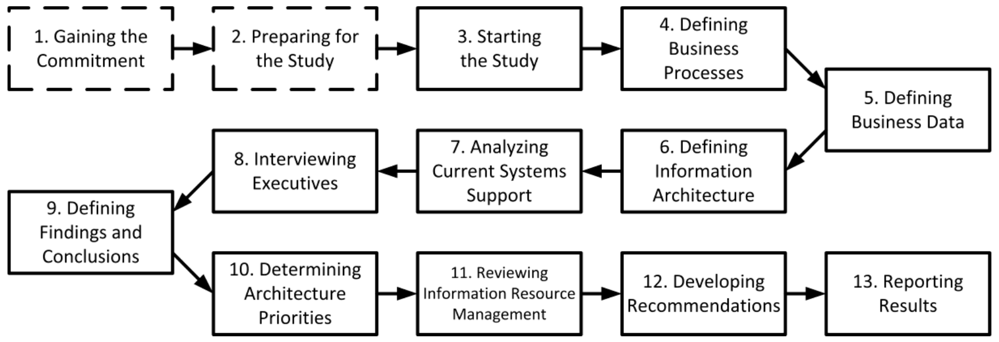

### Kerangka Kerja Arsitektur PRISM

-   Salah satu kerangka kerja arsitektur perusahaan pertama

-   Dikembangkan oleh konsorsium vendor IT

-   Berfokus pada integrasi sistem dan teknologi informasi

-   Membantu organisasi untuk memahami dan mengatur kompleksitas TI

### PRISM Enterprise Architecture Framework

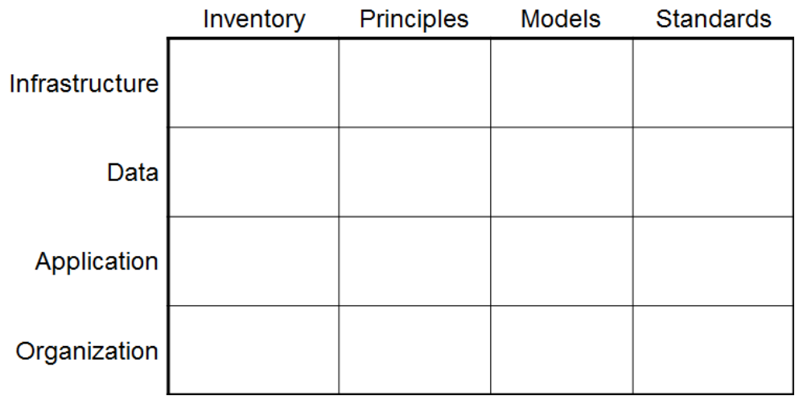

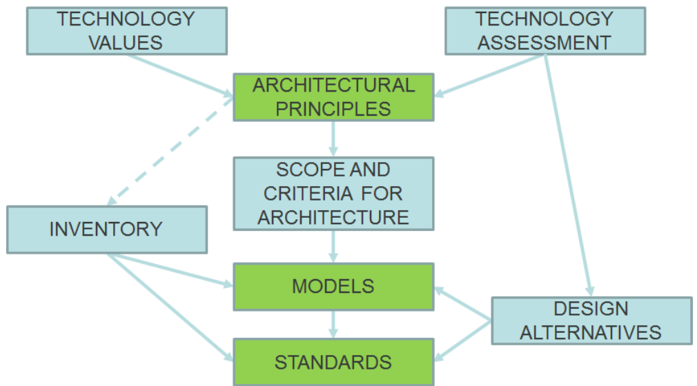

### Model Arsitektur Perusahaan NIST

-   Menekankan strukturisasi dan pengorganisasian operasi IT

-   Membagi arsitektur IT menjadi lima tingkatan

-   Berfokus pada bisnis, data, aplikasi, teknologi, dan hasil

-   Memungkinkan perencanaan strategis dan pengambilan keputusan
    berdasarkan data

### NIST Enterprise Architecture Framework

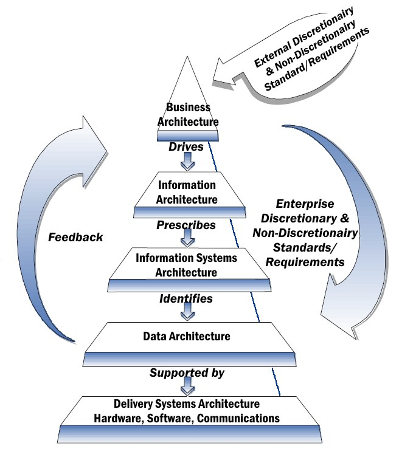

### Kerangka Kerja Zachman

-   Skema untuk memahami dan mengatur kompleksitas arsitektur perusahaan

-   Dibagi menjadi enam tingkatan berbeda

-   Merangkum dari tingkat paling abstrak hingga paling konkret

-   Cocok untuk berbagai jenis organisasi, dari bisnis hingga
    pemerintahan

### Zachman Framework

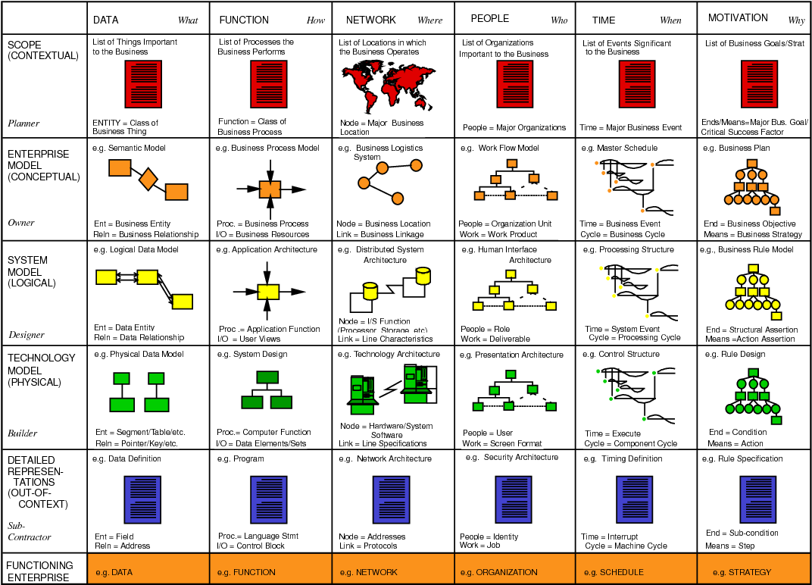

### Perencanaan Arsitektur Perusahaan (EAP)

-   Metode untuk merencanakan arsitektur sistem informasi

-   Mengidentifikasi apa yang dibutuhkan oleh bisnis dari teknologi
    informasi

-   Menyusun rencana untuk implementasi teknologi baru berdasarkan
    kebutuhan bisnis

-   Dapat membantu dalam transformasi digital dan perubahan organisasi

### Enterprise Architecture Planning

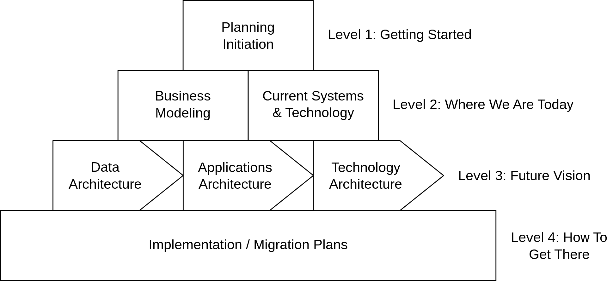

### Arsitektur Keamanan Bisnis Terapan Sherwood (SABSA)

-   Model dan metodologi untuk mengembangkan kerangka kerja keamanan
    informasi dan manajemen risiko

-   Merancang, mengimplementasikan, dan mengelola solusi keamanan yang
    berpusat pada bisnis

-   Dikembangkan dengan pendekatan \"awal-hingga-akhir\" dan
    \"atas-ke-bawah\"

-   Dapat disesuaikan dengan kebutuhan spesifik organisasi

### Sherwood Applied Business Security Architecture (SABSA)

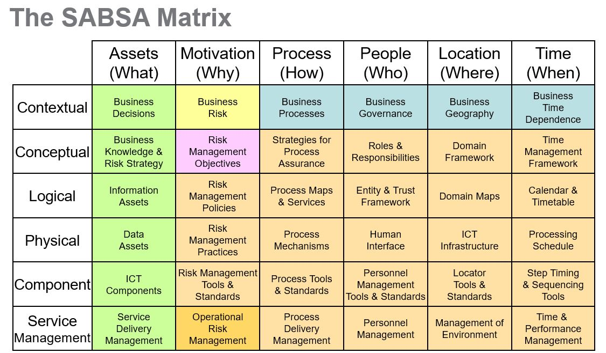

### Federal Enterprise Architecture Framework (FEAF)

-   Kerangka kerja yang digunakan oleh pemerintah federal AS

-   Membantu dalam meningkatkan efisiensi dan efektivitas pelayanan
    pemerintah

-   Memfasilitasi kerjasama antar agen dan departemen pemerintah

-   Merupakan bagian dari strategi modernisasi teknologi informasi
    pemerintah AS

### Federal Enterprsie Architecture Framework

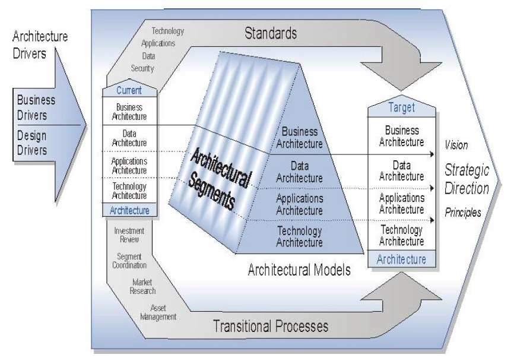

### Metode Arsitektur Perusahaan Gartner

-   Metode yang dikembangkan oleh perusahaan riset dan konsultasi
    Gartner

-   Memandu organisasi dalam merancang, mengembangkan, dan
    mengimplementasikan arsitektur perusahaan

-   Menghubungkan strategi bisnis dan IT

-   Membantu organisasi dalam mencapai tujuan transformasi digital

### Gartner's Enterprise Architecture Process

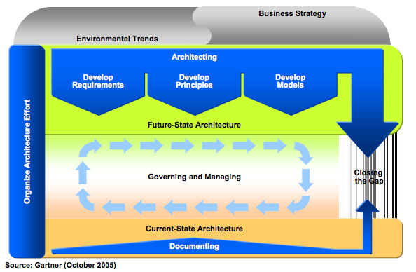

### Kerangka Kerja Arsitektur Departemen Pertahanan (DoDAF)

-   Kerangka kerja yang digunakan oleh Departemen Pertahanan AS

-   Membantu dalam mengorganisasi dan memvisualisasikan informasi yang
    penting untuk proses pengambilan keputusan

-   Menggunakan berbagai model dan panduan untuk mengembangkan
    arsitektur

-   Cocok untuk organisasi dengan kompleksitas dan skala besar

### Department of Defence Architecture Framework (DoDAF)

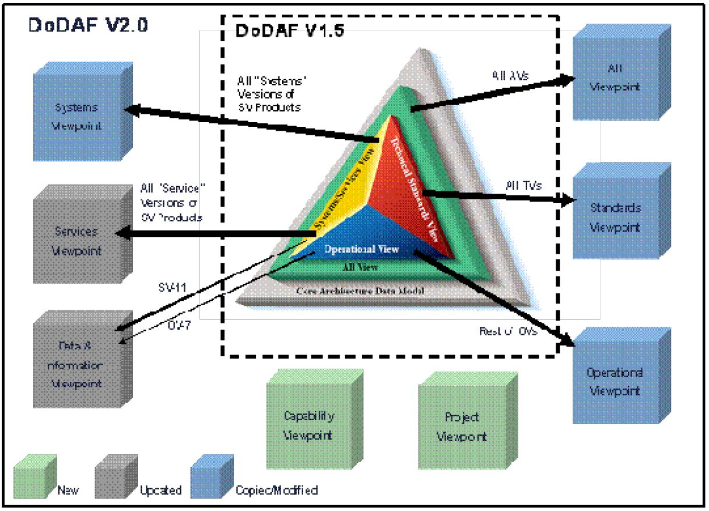

### Pemerintah Australia AGA

-   Kerangka kerja yang digunakan oleh Pemerintah Australia

-   Membantu dalam perencanaan dan implementasi teknologi informasi di
    tingkat pemerintahan

-   Mendorong kolaborasi antar departemen dan agen pemerintah

-   Meningkatkan efisiensi dan transparansi dalam layanan pemerintah

### Austarlian Government Architecture (AGA)

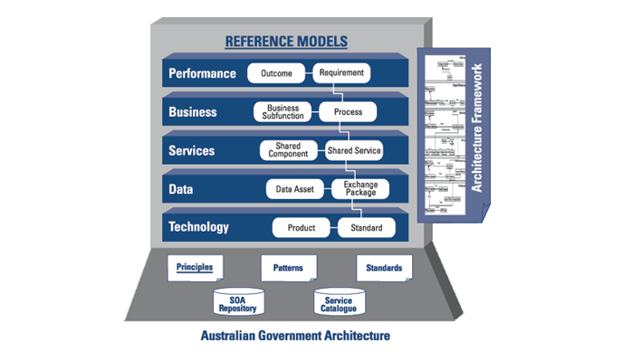

### Body of Knowledge Arsitektur Bisnis (BizBoK)

-   Panduan yang dikembangkan oleh Business Architecture Guild

-   Menyediakan praktik terbaik dan standar dalam arsitektur bisnis

-   Dapat digunakan oleh arsitek bisnis dan profesional terkait lainnya

-   Membantu organisasi dalam merancang dan mengimplementasikan
    arsitektur bisnis

### Business Architecture Body Of Knowledge

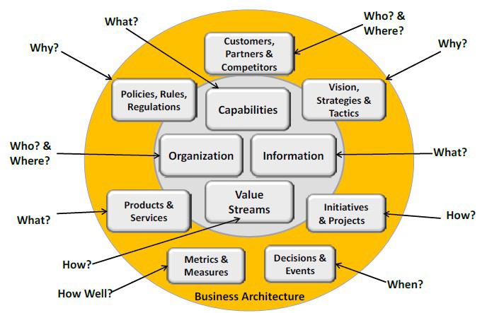

### Standar ISO untuk Pemodelan Perusahaan (ISO19439)

-   Standar internasional untuk pemodelan proses bisnis dan organisasi

-   Membantu dalam perencanaan, desain, dan perbaikan proses bisnis

-   Dapat digunakan oleh berbagai jenis organisasi, dari bisnis hingga
    pemerintahan

-   Dikembangkan oleh Organisasi Internasional untuk Standardisasi (ISO)

### ISO19439 Enterprise Modelling

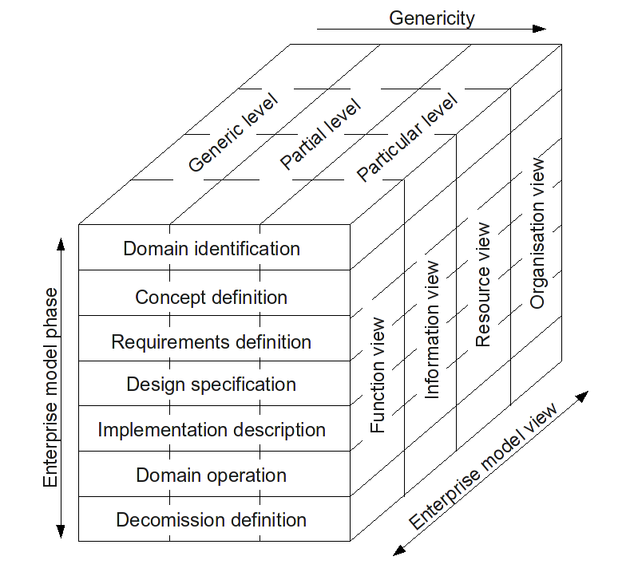

### Ringkasan

-   Ada berbagai kerangka kerja dan metodologi arsitektur perusahaan

-   Pilihan kerangka kerja atau metodologi tergantung pada kebutuhan dan
    konteks spesifik organisasi

-   Arsitektur perusahaan adalah alat penting untuk merencanakan dan
    mengelola teknologi informasi di organisasi
