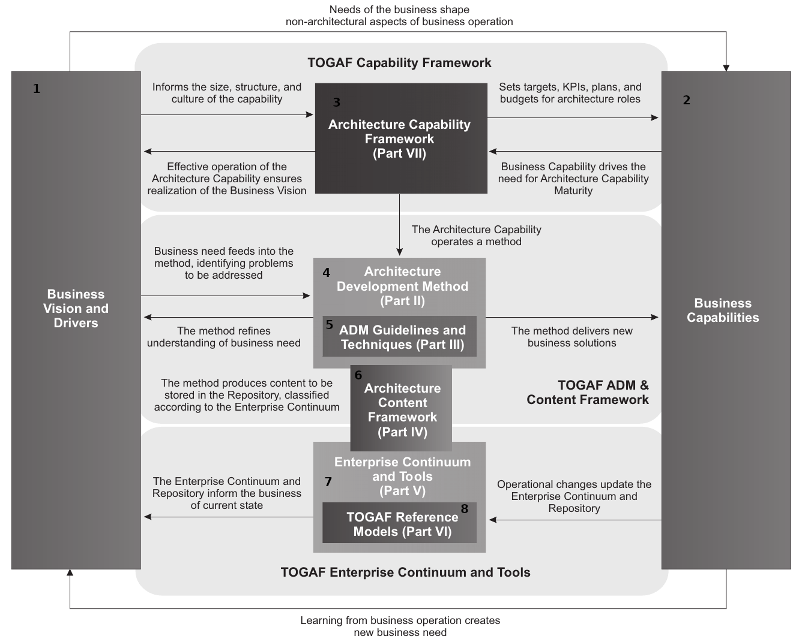
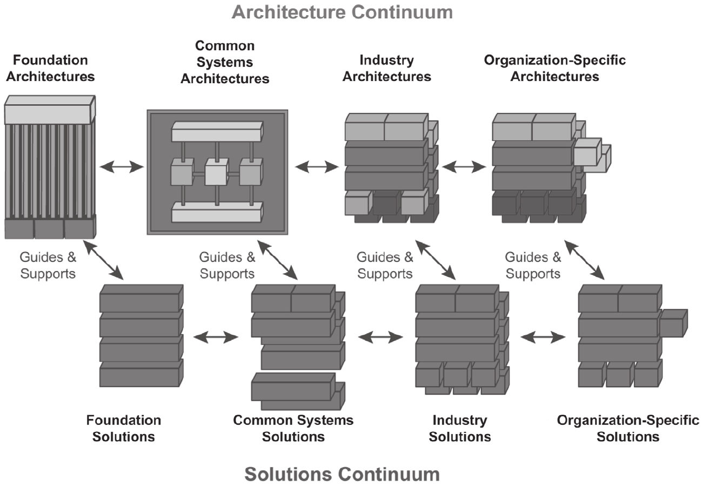

---
author:
- Alfa Yohannis
title: 'TOGAF Framework dan Komponen-Komponennya'
---

### Apa itu Kerangka Kerja TOGAF?

-   TOGAF adalah kerangka kerja untuk pengembangan arsitektur
    perusahaan.

-   Dikembangkan oleh The Open Group, sebuah konsorsium industri IT.

-   Terdiri dari metode dan alat untuk membantu dalam perancangan,
    implementasi, dan pengelolaan arsitektur perusahaan.

-   TOGAF berfokus pada pengelolaan siklus hidup arsitektur.

-   Menggunakan pendekatan siklus hidup yang dapat diulang dan iteratif.

### TOGAF Framework

### Komponen-komponen TOGAF

-   Business Visions and Drivers

-   Business Capabilities

-   TOGAF Capability Framework

-   Architecture Capability Framework

-   Architecture Development Method

-   ADM Guidelines and Techniques

-   Architecture Governance Frameworks

-   Architecture Content Framework

-   Deliverables, Artifacts, and Building Blocks

-   Enterprise Continuum and Tools

-   Architecture Repository

-   TOGAF Reference Models

### Visi dan Penggerak Bisnis di TOGAF

-   Visi bisnis adalah pandangan tentang tujuan dan masa depan
    organisasi.

-   Penggerak bisnis adalah faktor-faktor yang mendorong perubahan dalam
    organisasi.

-   TOGAF menggunakan visi dan penggerak bisnis untuk membantu
    mendefinisikan arsitektur perusahaan.

-   Visi dan penggerak bisnis dikembangkan selama fase Preliminary dan
    Architecture Vision dari ADM.

-   Dalam TOGAF, penggerak bisnis dapat mencakup faktor-faktor seperti
    perubahan teknologi, perubahan pasar, atau perubahan regulasi.

### Architecture Capability Framework

### Kemampuan Bisnis di TOGAF

-   Kemampuan bisnis adalah kombinasi dari orang, proses, dan teknologi
    yang memungkinkan suatu organisasi mencapai tujuannya.

-   TOGAF memandang kemampuan bisnis sebagai bagian integral dari
    arsitektur perusahaan.

-   Pemahaman yang baik tentang kemampuan bisnis dapat membantu dalam
    merancang dan implementasi arsitektur yang efektif.

-   Kemampuan bisnis diidentifikasi dan didefinisikan selama proses ADM.

-   Mereka kemudian digunakan untuk membantu dalam desain dan
    implementasi arsitektur.

### Kerangka Kemampuan TOGAF

-   Kerangka Kemampuan TOGAF membantu organisasi mendefinisikan,
    merencanakan, dan menerapkan arsitektur perusahaan.

-   Terdiri dari tujuh kategori kemampuan: visi, organisasi, proses,
    kemampuan, struktur, budaya, dan sumber daya.

-   Setiap kategori mencakup seperangkat kemampuan yang diperlukan untuk
    menghasilkan arsitektur perusahaan yang efektif.

-   Kerangka Kemampuan adalah bagian integral dari Metode Pengembangan
    Arsitektur (ADM).

-   Menggunakan Kerangka Kemampuan, organisasi dapat mengidentifikasi
    dan menutupi celah dalam kemampuan mereka.

### Kerangka Kemampuan Arsitektur

-   Kerangka Kemampuan Arsitektur adalah struktur konseptual yang
    mendukung pembuatan, interpretasi, analisis, dan penggunaan
    arsitektur.

-   Kerangka kerja ini mencakup komponen, hubungan, dan prinsip-prinsip
    arsitektur.

-   Kerangka kerja ini membantu organisasi mengidentifikasi,
    merencanakan, dan menerapkan perubahan dalam arsitektur mereka.

-   Kerangka Kemampuan Arsitektur adalah bagian integral dari TOGAF.

-   Membantu dalam pengelolaan siklus hidup arsitektur, dari konsepsi
    hingga pensiun.

### Architecture Development Method

### Metode Pengembangan Arsitektur (ADM)

-   ADM adalah proses yang direkomendasikan oleh TOGAF untuk
    mengembangkan arsitektur perusahaan.

-   Melibatkan serangkaian fase terorganisir yang membantu dalam
    perancangan, perencanaan, implementasi, dan pengelolaan arsitektur
    perusahaan.

-   Fase-fase tersebut termasuk Visi Arsitektur, Desain Bisnis, Desain
    Informasi, Desain Teknologi, hingga Implementasi.

-   ADM membantu organisasi mengelola siklus hidup keseluruhan dari
    arsitektur perusahaan.

-   ADM juga memberikan pedoman dan teknik untuk setiap fase dari proses
    pengembangan.

### Pedoman dan Teknik ADM

-   TOGAF menyediakan serangkaian pedoman dan teknik untuk membantu
    dalam penerapan ADM.

-   Pedoman ini membantu organisasi dalam menyesuaikan ADM dengan
    kebutuhan dan konteks mereka sendiri.

-   Beberapa teknik yang umum digunakan termasuk analisis stakeholder,
    analisis gap, dan penggunaan matriks arsitektur.

-   Pedoman dan teknik ini memastikan bahwa proses ADM tetap fokus,
    efisien, dan efektif.

-   Mereka juga membantu memastikan bahwa arsitektur yang dihasilkan
    sesuai dengan tujuan dan sasaran bisnis.

### Kerangka Kerja Tata Kelola Arsitektur di TOGAF

-   Tata kelola arsitektur adalah praktik mengelola dan mengendalikan
    arsitektur perusahaan.

-   Dalam TOGAF, kerangka kerja tata kelola arsitektur memberikan
    struktur untuk praktik-praktik ini.

-   Kerangka kerja ini mencakup aspek seperti struktur organisasi, peran
    dan tanggung jawab, proses, dan metode komunikasi.

-   Tata kelola arsitektur juga melibatkan pembuatan dan pemeliharaan
    artefak seperti prinsip arsitektur, model arsitektur, dan roadmap
    arsitektur.

-   Tujuan utamanya adalah untuk memastikan bahwa semua proyek tetap
    selaras dengan arsitektur perusahaan dan strategi bisnis secara
    keseluruhan.

### Kerangka Konten Arsitektur

-   Kerangka Konten Arsitektur mendefinisikan jenis konten arsitektural
    yang diperlukan untuk mencakup keseluruhan domain bisnis.

-   Ini memandu proses identifikasi, organisasi, dan pengembangan
    artefak.

-   Kerangka Konten Arsitektur terdiri dari tiga komponen utama:
    Deliverables, Artefak, dan Building Blocks.

-   Deliverables adalah hasil kerja yang diberikan kepada pemangku
    kepentingan. Artefak adalah bagian dari Deliverables yang
    mendeskripsikan arsitektur.

-   Building Blocks adalah komponen fisik, logis, atau konseptual dari
    sistem bisnis atau IT.

### Architecture Deliverables

### Deliverables, Artefak, dan Building Blocks di TOGAF

-   Deliverables adalah hasil kerja arsitektur yang diberikan kepada
    pemangku kepentingan.

-   Artefak adalah bagian dari Deliverables yang mendeskripsikan
    arsitektur dalam berbagai tingkat detail.

-   Building Blocks adalah komponen fisik, logis, atau konseptual dari
    sistem bisnis atau IT.

-   Contoh Deliverables: Dokumen Visi Arsitektur, Rencana Migrasi.

-   Contoh Artefak: Diagram Data, Diagram Aplikasi. Contoh Building
    Blocks: server, aplikasi, database.

### Architecture Continuum

### Kontinum dan Alat Perusahaan

-   Kontinum Perusahaan adalah pandangan \"virtual\" atau panduan yang
    menyediakan konteks untuk memahami dan mengelola artefak arsitektur.

-   Ini membantu organisasi mengidentifikasi dan memanfaatkan artefak
    yang relevan berdasarkan kebutuhan mereka.

-   Alat Perusahaan adalah alat dan teknik yang digunakan untuk
    mendukung pembuatan, manajemen, dan penggunaan arsitektur.

-   Contoh alat ini termasuk perangkat lunak pemodelan, alat manajemen
    proyek, dan alat dokumentasi.

-   Alat ini mendukung organisasi dalam menerapkan dan mengelola
    arsitektur perusahaan mereka.

### Architecture Repository

### Repositori Arsitektur di TOGAF

-   Repositori Arsitektur adalah tempat penyimpanan yang terorganisir
    untuk semua artefak yang dihasilkan oleh arsitek selama siklus hidup
    ADM.

-   Repositori ini membantu dalam penyimpanan, pengelolaan, dan
    penggunaan kembali informasi arsitektural.

-   Repositori ini melibatkan tiga level: Foundation Architecture,
    Common Systems Architecture, dan Industry Architecture.

-   Repositori ini juga mendukung pengelolaan dan pemantauan Kontrak
    Arsitektur.

-   Repositori ini memudahkan manajemen artefak dan deliverable dalam
    lingkungan multi-proyek.

### Technical Reference Model

### Integrated Information Infrastructure Reference Model

### Model Referensi TOGAF

-   Model Referensi TOGAF adalah kerangka kerja yang memberikan titik
    awal yang bermanfaat untuk organisasi yang mencari bantuan dengan
    inisiatif arsitektur mereka.

-   Ini memberikan model dasar yang dapat digunakan sebagai dasar untuk
    mengembangkan arsitektur yang lebih spesifik dan rinci.

-   Model Referensi TOGAF meliputi Model Referensi Arsitektur Teknis
    (TRM) dan Model Referensi Integrasi Sistem Terbuka (III-RM).

-   TRM memberikan model dan taksonomi umum untuk teknologi yang
    mendukung bisnis aplikasi, seperti sistem operasi, perangkat keras,
    dan jaringan.

-   III-RM memberikan model untuk arsitektur dan komponen yang
    memungkinkan portabilitas, interoperabilitas, dan reuse aplikasi
    yang lebih besar.

### Ringkasan

-   TOGAF adalah kerangka kerja arsitektur perusahaan yang komprehensif
    yang membantu organisasi dalam merancang, merencanakan, menerapkan,
    dan mengelola arsitektur informasi mereka.

-   TOGAF melibatkan berbagai aspek seperti visi dan driver bisnis,
    kapabilitas bisnis, kerangka kerja kapabilitas, metode pengembangan
    arsitektur, dan lainnya.

-   Dalam TOGAF, artefak, deliverable, dan building blocks digunakan
    untuk membantu dalam proses pengembangan arsitektur.

-   Kontinum dan alat perusahaan di TOGAF membantu organisasi memahami
    dan memanfaatkan kerangka kerja ini secara efektif.

-   Repositori Arsitektur dan Model Referensi TOGAF adalah komponen
    acuan pengetahuan yang penting untuk mendukung proses ADM.
